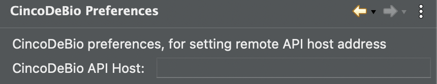

# Install Instructions

## Prerequisites

### ### General

#### Docker Hub Account

- Currently all the images used for both the CdB core serivces and domain specific data processing services (used in a workflow) are stored on a public docker hub repository. In order to avoid rate limiting, the install will request valid dockerhub credentials (username & password).

#### Hardware

* Tested on:
  * **Macbook Pro 14"**
    * Storage:
      * SSD
    * RAM:
      * 16GB LPDDR5
    * OS:
      * 14.1.2 (23B92)
    * CPU:
      * Apple M1 Pro
    * Software Dependencies:
      * Multipass:
        * v1.13.1
      * Microk8s:
        * v2.3.4
  * **Dell Precision 3660**
    * Storage:
      * SSD / HDD
    * RAM:
      * 64GB
    * OS:
      * Window
    * CPU:
      * Intel i9
    * GPU:
      * Nvidia 3090
  * **Precision 5820 Tower**
    * Storage
      * SSD / HDD
    * RAM
      * 128 GB
    * OS
      * Windows 10 Pro
    * CPU
      * Intel(R) Xeon(R) W-2255 CPU
    * GPU
      * ?

### ### Windows 10/11

* Windows Subsystem for Linux (WSL) 2
  * The microk8s cluster is deployed with-in an Ubuntu-22.04 LTS instance running with-in WSL2
  * By default WSL enables a maximum of the 50% of the system RAM to be used (this can be changed be editing the .wslconfig file if needed)
  * **Please Note:** WSL will only work with system names (i.e. what you name your windows machine in settings) that contain lower-case charachters, numbers & hyphens.
* Microk8s
  * The Kubernetes native application is deployed on a Microk8s cluster

### MacOS

* Homebrew
  * Used for installing various dependencies
* Multipass
  * The microk8s cluster is deployed with-in a multipass virtual machine
* Microk8s
  * The Kubernetes native application is deployed on a Microk8s cluster

### Linux

An Ubuntu 22.04 LTS, 20.04 LTS, 18.04 LTS or 16.04 LTS environment to
run the commands (or another operating system which supports `snapd`

## Install Steps

The alpha version of Cinco de Bio currently consists of two seperate applications. The Integrated Modelling Environment (IME) which is an Eclipse-based Desktop Application and the Execution Platform which is a Kubernetes native application.

These two applications both need to be installed (instructions below).

We are currently working on merging the CdB execution platform with [Cinco Cloud](link-to-cinco-cloud) (also a Kubernetes native Application) so in future versions the entire platform (IME and Execution Platform) will be combined and deployed together.

### Windows 10/11

#### Execution Platform

Download the [powershell script](linktoscrip) which install the execution platform and it's dependencies.

Navigate to the folder which contains the powershell script, right click on the file and select the option '`Run with powershell as Admin`. If that option isn't present find the `Powershell` icon in the Windows menu, right click on it and select the option `Run as administrator`. Navigate to the folder the powershell script has been downloaded too with command `cd <path/to/folder>` replacing `<path/to/folder>` with the actuall path folder on your machine. Finally run the command `.\deploy.ps1` (**Note:** If this fails run the command `Set-ExecutionPolicy RemoteSigned`, then re-run the script using `.\deploy.ps1`)

The script will first install WSL (if not already installed) with an instance of Ubuntu-22.04 LTS. (If it exits and prints `Hostname is invalid. Exiting.` see note above; Prerequisites->Windows 10/11->Windows Subsystem for Linux). During the install of Ubuntu-22.04 LTS you will prompted to complete the ubuntu configuration (i.e. set  username and password, etc..). Depending on your windows version this may launch in a new powerhsell window (once complete just return to the original powershell). If a new window isn't opened, once Ubuntu config is complete, enter `CTRL+D` to exit the Ubuntu terminal and continue with the install in powershell. The script will then configure Ubuntu so it can be used with CdB, and restart WSL. 

You will first be prompted to enter your DockerHub Username followed by your DockerHub Password (ensure these are correct as deployment will fail otherwise).¸

Next the script will install microk8s. **Note**: By default WSL is deployed on the `C:` drive, once microk8s is installed *this script will automatically move the WSL instance on the drive with the most available storage*. It will then restart the cluster and install the various addons and configurations required for running the CdB execution platform that will be deployed on the cluster. 

Finally the CdB services will be deployed on the cluster.

The IP address for the cluster will be printed; Please note this down as you will need to add it to CdB in the IME so that the IME can communicate with the execution platform. The url to access to data-upload portal will also be printed

#### Integrated Modelling Environment

Download the [application](linktoapp) and unzip it. The IME can be launched by double clicking on `hippoflowtool.exe` in the unzipped folder.

**Note:** Windows places restrictions on the maximum path length, therefore we recommending moving the zip file to the root directory ( `C:/`) before unzipping it, to avoid these errors.

##### Configure Java Virtual Machine (If Necessary)

The IME requires Java 11 to be installed to on your machine to work. If you do not have a Java 11 already on your machine (and configured on your path) follow these instructions

1. Head to the [Temurin webite](https://adoptium.net/temurin/releases/?version=11&package=jdk&os=windows&arch=any) and select options from the dropdown for 'Architecture' to match your system.
2. Download the JDK (.zip version), unzip it and rename the unzipped folder `jre`.
3. Find the folder for the IME, it should be named something like `HippoFlowTool-1.202405081710`. Open it.
4. Move/Copy the extracted `jre folder` (from step 2) into the `HippoFlowTool-1.202405081710 folder`.

##### Add Execution Platform IP address to Preference

In the IME navigate to `Hippoflow -> Setting -> CincoDeBio Preferences` in the menu.

You should see a form like the one below:

...

Next, enter in the IP address (which was displayed when the execution platform was installed. Don't included http(s)://, etc.. Only the IP address (i.e. 0.0.0.0)

Hit **Apply and Close.**

Finally hit the Refresh CdB SIBs button on the top toolbar, this will synchronise the SIB palette with the set of SIBs available on the execution platform.

### MacOS

#### Execution Platform

Download the [bash script ](linktofile)which installs the execution platform and it's dependencies.

To run the script open *Terminal* and `bash <path-to-script>/deploy.sh` replacing `<path-to-script>` with the directory you saved the script to. 

You will first be prompted to enter your DockerHub Username followed by your DockerHub Password (ensure these are correct as deployment will fail otherwise).

Next you will be asked the resources you wish to allocate to the Execution Platform; Number of CPU cores, GB of RAM and GB of Storage.

The script will now check if you have Homebrew installed on your machine, if Homebrew is not installed, it will be installed for you (you may need to enter your system password as a part of the install process).

Next the script will check if you have Multipass installed on your machine, if not it will be installed for you (you may need to enter your system password as a part of the install process).

Next the script will install microk8s. It will deploy a VM called microk8s-vm in Mutlipass and deploy then Microk8s cluster, then wait for it to start up. Once the cluster has started, the various addons and configurations required for running the CdB execution platform will be deployed on the cluster. The cluster will then be restarted.

Finally the CdB services will be deployed on the cluster.

The IP address for the cluster will be printed; Please note this down as you will need to add it to CdB in the IME so that the IME can communicate with the execution platform. The url to access to data-upload portal will also be printed

#### Integrated Modelling Environment

Download the [application](linktoapp) and unzip it.

##### Configure Java Virtual Machine (If Necessary)

The IME requires Java 11 to be installed to on your machine to work. If you do not have a Java 11 already on your machine (and configured on your path) follow these instructions

1. Head to the [Temurin webite](https://adoptium.net/temurin/releases/?version=11&package=jdk&os=mac&arch=any) and select options from the dropdown for 'Architecture' to match your system.
2. Download the JDK (.tar.gz version), unzip it and rename the unzipped folder `jre`.
3. Find the .APP file for the IME, it should be named something like 'HippoFlowTool-1.202405081710.app'. Right click on the file and select 'Show Package Contents' - this will open the package as a directory.
4. The file structure will look as below:
   - `Contents`
     - `Eclipse (folder)`
     - `Info.plist (file)`
     - `MacOS (folder)`
5. Move/Copy the extracted `jre folder` (from step 2) into the `Eclipse folder` in the HippoFlowTool package directory.

##### Add Execution Platform IP address to Preference

In the IME navigate to `Hippoflow -> Setting -> CincoDeBio Preferences` in the menu.

You should see a form like the one below:

Next, enter in the IP address (which was displayed when the execution platform was installed. Don't included http(s)://, etc.. Only the IP address (i.e. 0.0.0.0)

Hit **Apply and Close.**

Finally hit the Refresh CdB SIBs button on the top toolbar, this will synchronise the SIB palette with the set of SIBs available on the execution platform.

### Linux

#### Execution Platform    

...

#### Integrated Modelling Environment

...
